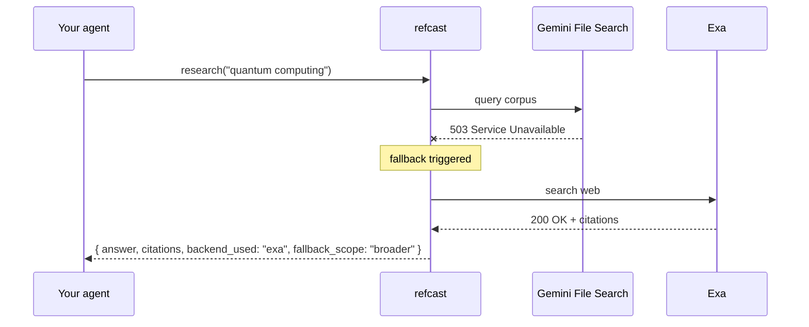
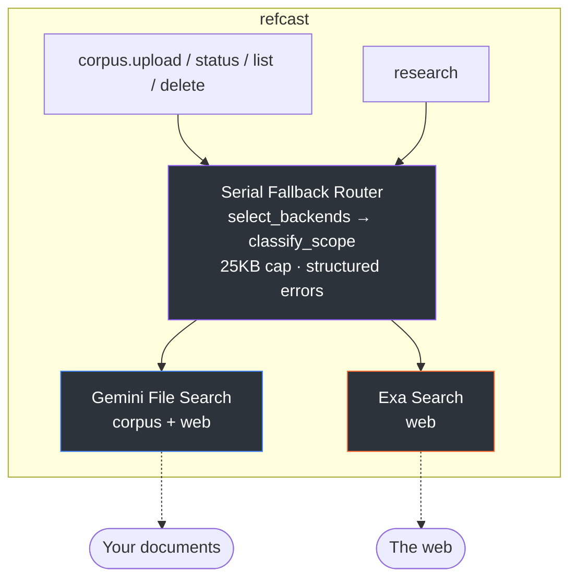

<div align="center">

# refcast

**Cast once. Cite anywhere.**

An open-source MCP server that sends your research queries to multiple backends — if one goes down, the next one picks up automatically, and your citations come back in the same shape every time. Answers include inline `[1]` `[2]` citation markers synthesized from source evidence, with an optional `depth="deep"` mode that fans out into multiple perspectives for comprehensive coverage. Works with Claude Code, Cursor, Gemini CLI, and any MCP client.

[](LICENSE)
[](https://python.org)
[](https://github.com/sznix/refcast/actions/workflows/test.yml)
[](https://claude.ai/code)
[](https://modelcontextprotocol.io)
[](https://gofastmcp.com)

</div>

---

## The problem

Every NotebookLM MCP breaks every 7-14 days when Google rotates cookies. Your agent crashes at 2am. You wake up, re-auth, retry. Repeat.

**refcast doesn't fight this. It routes around it.**



Your agent's code never changes. Citations come back in the same shape. The `fallback_scope` field tells you what happened.

## Install

```bash
# From PyPI (available after v0.1.0 release)
uv tool install refcast
pipx install refcast
pip install refcast

# From source (available now)
pip install git+https://github.com/sznix/refcast.git
```

## Setup (2 minutes)

You need **at least one** API key. Both have free tiers (no credit card required):

| Backend | Free tier | Get key |
|:--------|:----------|:--------|
| Gemini File Search | ~1,500 req/day | [aistudio.google.com/apikey](https://aistudio.google.com/apikey) |
| Exa web search | 1,000 searches/month | [dashboard.exa.ai/api-keys](https://dashboard.exa.ai/api-keys) |

> refcast works with **just one key** — if you only have Gemini, it uses Gemini. If you only have Exa, it uses Exa. Both = full fallback resilience.

```bash
# Option A: macOS / Windows (secure keychain storage)
refcast auth --store keyring

# Option B: Environment variables (works everywhere including Linux/Docker)
export GEMINI_API_KEY="your-key-here"
export EXA_API_KEY="your-key-here"

# Option C: .env file
refcast init                     # creates .env.example
cp .env.example .env             # copy template
# edit .env with your keys

# Verify setup
refcast doctor
# Gemini: configured
# Exa:    configured
```

### Claude Code (recommended)

refcast was built and tested with [Claude Code](https://claude.ai/code). Setup is one JSON block:

```json
// Add to ~/.claude.json under "mcpServers":
{
  "refcast": {
    "command": "refcast-mcp"
  }
}
```

Restart Claude Code. Your tools appear as `mcp__refcast__*`. Try it:

```
> Use refcast to research "what is retrieval augmented generation" with depth=deep
```

Claude will call `mcp__refcast__research`, get a synthesized answer with `[1]` `[2]` markers pointing to real sources, and use the citations in its response.

<details>
<summary><b>Cursor / Windsurf / Gemini CLI / Other MCP clients</b></summary>

Register the server with command `refcast-mcp` (stdio transport). Consult your client's MCP configuration docs. refcast works with any MCP-compatible client — Claude Code is just where we test it most.

</details>

## What you get

### 5 MCP tools

| Tool | What it does |
|:-----|:-------------|
| `corpus.upload(files)` | Upload PDFs/docs to Gemini File Search. Returns immediately; indexing runs async. |
| `corpus.status(corpus_id)` | Check indexing progress. Poll until `indexed: true`. |
| `corpus.list()` | List all your corpora with file counts and sizes. |
| `corpus.delete(corpus_id)` | Remove a corpus and all its files. |
| **`research(query)`** | **The main tool.** Routes query across backends, returns unified citations with inline `[1]` `[2]` markers. Pass `constraints={"depth": "deep"}` for multi-perspective research. |

### Unified citation envelope

Every backend returns the same shape. Swap engines without touching a single parser.

```json
{
  "answer": "Retrieval-augmented generation (RAG) is a technique that grants generative AI models access to external knowledge [1], combining retrieval with generation for more accurate responses [2]...",
  "citations": [
    {
      "text": "Retrieval-augmented generation (RAG) is a technique that grants generative AI...",
      "source_url": "https://en.wikipedia.org/wiki/Retrieval-augmented_generation",
      "author": null,
      "date": null,
      "confidence": 1.0,
      "backend_used": "exa",
      "raw": {}
    },
    {
      "text": "What is Retrieval Augmented Generation (RAG)? The Key to Smarter, More Accurate...",
      "source_url": "https://www.digitalocean.com/resources/articles/rag",
      "author": null,
      "date": "2026-03-12T04:16:30.000Z",
      "confidence": 0.5,
      "backend_used": "exa",
      "raw": {}
    },
    {
      "text": "Retrieval-Augmented Generation: A Comprehensive Survey of Architectures...",
      "source_url": "https://arxiv.org/html/2506.00054v1",
      "author": null,
      "date": null,
      "confidence": 0.0,
      "backend_used": "exa",
      "raw": {}
    }
  ],
  "backend_used": "exa",
  "latency_ms": 383,
  "cost_cents": 0.7,
  "fallback_scope": "none",
  "warnings": [],
  "error": null
}
```

> This is **real output** from a live `research()` call, not a hypothetical example.

### Structured errors (not string messages)

When things go wrong, your agent gets machine-actionable errors:

```json
{
  "code": "rate_limited",
  "message": "Gemini 429",
  "recovery_hint": "Wait then retry, or accept fallback result.",
  "recovery_action": "retry",
  "retry_after_ms": 30000,
  "fallback_used": true
}
```

14 error codes, each with a clear next step: **retry** (transient, try again), **fallback** (try another backend), or **user_action** (you need to fix something). Your agent can branch on these without guessing.

<details>
<summary><b>Full error taxonomy (14 codes)</b></summary>

| Code | When | Recovery |
|:-----|:-----|:---------|
| `rate_limited` | Backend 429 | retry |
| `quota_exceeded` | Account limit reached | user_action |
| `network_timeout` | HTTP timeout | retry |
| `auth_invalid` | Bad API key | user_action |
| `corpus_not_found` | Unknown corpus_id | user_action |
| `empty_corpus` | Corpus has 0 indexed files | user_action |
| `backend_unavailable` | All backends down | user_action |
| `schema_mismatch` | Unexpected response shape | fallback |
| `parse_error` | No citations when required | fallback |
| `indexing_in_progress` | Corpus still indexing | retry |
| `file_too_large` | File exceeds 100MB | user_action |
| `unsupported_format` | Not PDF/TXT/HTML/DOCX | user_action |
| `partial_index` | Some files failed to index | (warning) |
| `unknown` | Uncategorized | fallback |

</details>

### Fallback tracking — what actually happened?

When refcast falls back to a different backend, `fallback_scope` tells your agent exactly what happened:

| Value | Meaning |
|:------|:--------|
| `none` | Primary backend answered. No fallback. |
| `same` | Fallback served same data scope. |
| `broader` | Fallback widened scope (corpus -> web). |
| `different` | Fallback served fundamentally different data. Treat with caution. |

This tells your agent whether it should trust the answer as-is, or ask again with more context.

## Architecture



**Adding a backend is one file.** Every backend implements the same simple Protocol (3 methods). Want to plug in Perplexity, SurfSense, or your own RAG? Write one Python file and you're done.

## How it compares

| Feature | refcast | jacob-bd notebooklm-mcp | Single-backend MCPs |
|:--------|:-------:|:-----------------------:|:-------------------:|
| Multi-backend routing | **Yes** | No | No |
| Auto-failover | **Yes** | No | No |
| Unified citation schema | **Yes** | Backend-specific | Backend-specific |
| Structured error protocol | **14 codes** | Generic errors | Varies |
| Fallback scope classification | **4-level** | N/A | N/A |
| Cookie-free (ToS-clean) | **Yes** | No (scraping) | Varies |
| Cost visibility per query | **Yes** | No | No |
| Works when Google changes things | **Yes** | Breaks ~biweekly | Varies |

> These tools work great together. Use jacob-bd to query your existing NotebookLM notebooks; use refcast when you want multi-backend research that doesn't break when Google rotates cookies.

## Cost

| Usage | Monthly cost |
|:------|:-------------|
| Casual (5-10 queries/day) | **$0** (free tiers) |
| Regular (30 queries/day) | **~$1** |
| Heavy (150 queries/day) | **~$15** |

Both Gemini and Exa have generous free tiers. No credit card required to start.

## Roadmap

| Version | Status | What's new |
|:--------|:-------|:-----------|
| **v0.1** | **Shipped** | 5 tools, 2 backends, serial fallback, unified citations, structured errors |
| **v0.2** | **Shipped** | Answer synthesis with `[1]` `[2]` markers, `depth="deep"` multi-perspective research, citation deduplication |
| v0.3 | Planned | NotebookLM Enterprise API backend, statistical drift detection, idempotency |
| v0.4 | Future | Formally-bounded semantic cache, plugin auth strategies, cost governance |

## Privacy & safety

refcast is a **local process** — it runs on your machine, not a cloud server. No telemetry. No analytics. No data collection.

Your queries and documents are sent **only** to the APIs you configure (Gemini, Exa) — subject to **their** privacy policies, not ours. If your research contains sensitive information, review:
- [Google Gemini API terms](https://ai.google.dev/gemini-api/terms)
- [Exa terms of service](https://exa.ai/terms)

refcast does NOT validate citation accuracy — it normalizes citation **format**. Always verify citations independently for high-stakes use.

## Development

```bash
git clone https://github.com/sznix/refcast
cd refcast
uv venv && source .venv/bin/activate
uv pip install -e ".[dev]"

# Run tests
pytest -m "not integration"       # 152 unit tests
pytest -m integration             # requires real API keys

# Lint + types
ruff check . && ruff format --check .
mypy src/refcast/                 # strict mode
```

### Project structure

```
src/refcast/
  backends/         # BackendAdapter implementations (gemini_fs.py, exa.py)
  tools/            # MCP tool handlers (corpus_upload.py, research.py, ...)
  router.py         # Serial fallback orchestrator + scope classifier
  models.py         # TypedDicts, RecoveryEnum, Citation, ResearchResult
  config.py         # Credential loading (dotenv + keyring chain)
  size_guard.py     # 25KB response cap enforcement
  mcp.py            # FastMCP server entry point
  cli.py            # refcast init / auth / doctor
```

### Testing

152 unit tests with `respx` HTTP mocking + 5 gated integration tests against real APIs. CI runs on Python 3.11/3.12/3.13 across Ubuntu and macOS.

```bash
pytest -m "not integration" -q     # fast, no API keys needed
pytest -m integration -q           # real calls, needs GEMINI_API_KEY + EXA_API_KEY
```

## License

[MIT](LICENSE) &copy; 2026 sznix

---

<div align="center">

**Your agent deserves research tools that don't break.** refcast gives you reliable, citation-backed answers that stay consistent even when providers change their APIs. Built with and for [Claude Code](https://claude.ai/code).

[Report a bug](https://github.com/sznix/refcast/issues) &middot; [Request a feature](https://github.com/sznix/refcast/issues)

</div>
